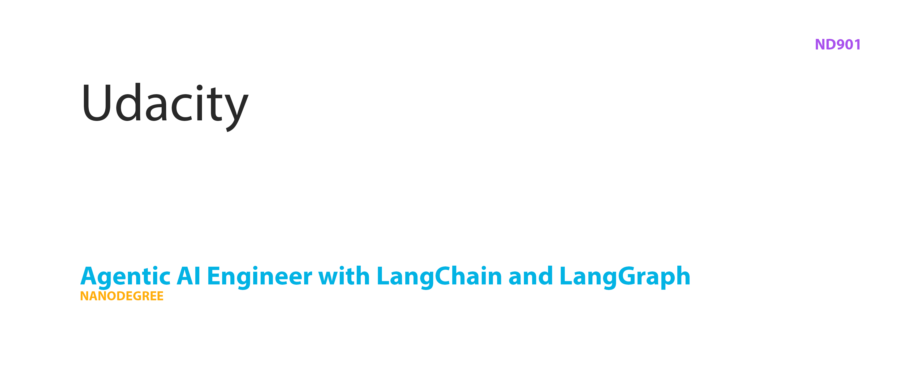

#### [ND901 - Agentic AI Engineer with LangChain and LangGraph](https://www.udacity.com/course/agentic-ai-engineer-with-langchain-and-langgraph--nd901)

[](https://www.udacity.com/course/agentic-ai-engineer-with-langchain-and-langgraph--nd901)
## Prerequisites

This project is set up on top of the python tooling of [Astral.sh](https://astral.sh/), escpecially their package manager `uv`. If you have it already installed you can set up this project and install all dependencies by running the following command inside the root folder.

```
uv sync
``` 

Otherwise you can find a quick install guide in this [documentation](https://docs.astral.sh/).

## [Course 1: LangChain Agentic AI Fundamentals](./course-1-langchain-agentic-ai-fundamentals) 
This course provides a comprehensive overview of building intelligent agentic applications using LangChain. Participants will learn to create simple LangChain applications and explore structured outputs. The curriculum progresses through multi-step workflows, transitioning from LLM calls to developing agents, and covers essential agentic design patterns. Key concepts include extending agents with tools, managing functions, and understanding state management within LangGraph. Students will also implement short-term agent memory techniques and complete a hands-on project: building a report-generating agent.